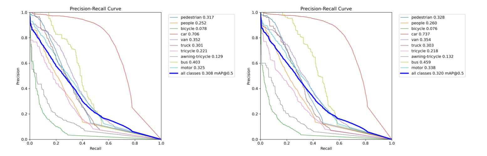

## Image Processing and computer vision HW2

> Author: Kr.Cen
> SID: 521021910151
> Date: 2023.12.24

[toc]

---

### 1. Finetuning

Adopted Dataset: `VisDrone`

> Which includes 10 classes:   0: pedestrian  1: people  2: bicycle  3: car  4: van  5: truck  6: tricycle  7: awning-tricycle  8: bus  9: motor.

Adopted Pre-trained model: `yolov8n.pt`

My hyperparameters: 

~~~py
from ultralytics import YOLO

model = YOLO('yolov8n.pt')

model.info()

# No.1
results = model.train(data='VisDrone.yaml', epochs=20, device=[0, 1, 2, 3])

# No.2-3
results = model.train(data='VisDrone.yaml', epochs=20, cls=0.7, dfl=1.7, box=8.0, device=0)
results = model.train(data='VisDrone.yaml', epochs=50, cls=0.7, dfl=1.7, box=8.0, device=1)

# No.4-5
results = model.train(data='VisDrone.yaml', epochs=20, lr0=8e-3, lrf=5e-3, imgsz=640, device=2)
results = model.train(data='VisDrone.yaml', epochs=50, lr0=8e-3, lrf=5e-3, imgsz=640, device=3)

# No.6-8
results = model.train(data='VisDrone.yaml', epochs=20, cls=0.7, dfl=1.7, box=8.0, lr0=8e-3, lrf=5e-3, imgsz=640, device=0)
results = model.train(data='VisDrone.yaml', epochs=50, cls=0.7, dfl=1.7, box=8.0, lr0=8e-3, lrf=5e-3, imgsz=640, device=1)
results = model.train(data='VisDrone.yaml', epochs=50, cls=0.4, dfl=1.3, box=7.0, lr0=8e-3, lrf=5e-3, imgsz=640, device=0)
~~~

We edit some core arguments:

* epochs: training rounds
* imgsz: input image size
* cls: cls loss gain (scaled by pixel)
* dfl: dfl loss gain
* box: box loss gain
* lr0: initial learning rate
* lrf: final learning rate

---

### 2. Performance comparison

#### F1-Confidence Curve

First analyze the F1-Confidence Curve, we give the peak value of F1 and its corresponding confidence.

| No.            | Original | 1     | 2     | 3     | 4     | 5     | 6     | 7     | 8     |
| -------------- | -------- | ----- | ----- | ----- | ----- | ----- | ----- | ----- | ----- |
| **Maximal F1** | 0.53     | 0.31  | 0.33  | 0.35  | 0.33  | 0.36  | 0.33  | 0.36  | 0.35  |
| **Confidence** | 0.241    | 0.130 | 0.165 | 0.163 | 0.149 | 0.165 | 0.147 | 0.159 | 0.153 |

**1. What a smaller confidence stands for?**

When confidence in F1-Confidence Curve is small, this means the model is more conserved for prediction, only when it is very confident that the content will be predicted as positive.

**2. What the value of F1-peak stands for?**

The peak of the F1 value indicates that the model achieves an optimal balance between accuracy and recall at this particular level of confidence. To be specific:

- **High F1 values: ** indicates that the model achieves both high accuracy and high recall at this level of confidence. This is an ideal situation, as F1 scores take into account the tradeoff between the two and are particularly useful for dealing with problems of unbalanced class distribution.
- **Low F1 values: ** may indicate that the model has a poor balance between accuracy and recall at this confidence level, and may tend to improve one metric at the expense of the other. In this case, you may want to consider adjusting the thresholds or other parameters of the model to meet specific needs.

We can find out that if the models are trained by more epoches, the maximal F1 value will be greater, and the `cls`, `dfl`, `box` losses will influence the corresponding confidence.

**In general, No.5 model is the most outstanding among them.**

> results = model.train(data='VisDrone.yaml', epochs=50, lr0=8e-3, lrf=5e-3, imgsz=640, device=3) # No.5 hyperparameters

---

#### Precision-Recall Curve

Then we analyze the precision-recall curve, we show the pics of model No.3 & 5 for simplification.

We find that the finetuning model cannot tell bicycle and awning-tricycle accurately, since it quickly got a low precision when enlarging the recall value.

---

#### Precision-Confidence Curve

Again, we show the pics of model No.3 & 5 for simplification.

We find that when enlarging the confidence, most classes can have a better predicting precision. However, the classes `tricycle` and `van` will probably get a severe vibration.

> results = model.train(data='VisDrone.yaml', epochs=50, cls=0.7, dfl=1.7, box=8.0, device=1) # Model No.3
> results = model.train(data='VisDrone.yaml', epochs=50, lr0=8e-3, lrf=5e-3, imgsz=640, device=3) # Model No.5

In right graph we can tell the vibration of `tricycle` no longer exists, we jump to the conclusion that this is due to the adjustment of initial learning rate and final learning rate.

#### Matrics/Precision

We now look into the metrics/precision of each models.

|                 | 1 | 2 | 3 | 4 | 5 | 6       | 7       | 8       |
| --------------- | -------------- | -------------- | -------------- | -------------- | -------------- | ---- | ---- | ---- |
| Final Precision | 0.36316 | 0.40321 | 0.43324 | 0.39615 | 0.435 | 0.40973 | 0.43824 | 0.42333 |
| Final box loss | 1.441 | 1.4902 | 1.4117 | 1.3911 | 1.3182 | 1.49 | 1.4129 | 1.2284 |
| Final cls loss | 1.0802 | 1.4182 | 1.2707 | 1.0221 | 0.9186 | 1.4198 | 1.2703 | 0.73812 |
| Final dfl loss | 0.9331 | 1.0506 | 1.0294 | 0.92587 | 0.90721 | 1.0503 | 1.0298 | 0.7861 |
| mAP50-95 | 0.15856 | 0.16476 | 0.18304 | 0.16597 | 0.18398 | 0.16688 | 0.1813 | 0.18144 |

> mAP50-95 (mean Average Precision with IoU threshold 0.5 to 0.95) is an indicator to evaluate the performance of target detection models. It is a variant of Average Precision (AP) that provides performance evaluation of models at different detection difficulties by calculating accuracy at different IoU (Intersection over Union) thresholds.

By analyzing the above-mentioned data, we have the following conclusions:

* Model No.5 is the best in general, since mAP50-95 is an important metric for detective models' ability. 

  ~~~py
  results = model.train(data='VisDrone.yaml', epochs=50, lr0=8e-3, lrf=5e-3, imgsz=640, device=3) # Model No.5
  ~~~
  
  As we can see, we just simply enlarge the epoches and minify the learning rate.

* Model No.7 has the highest precision, since it is adjusted based on Model No.5 with modifying losses.

  ~~~py
  results = model.train(data='VisDrone.yaml', epochs=50, cls=0.7, dfl=1.7, box=8.0, lr0=8e-3, lrf=5e-3, imgsz=640, device=1) # Model No.7
  ~~~

* Compare Model No.5 & 7 & 8

  ~~~py
  results = model.train(data='VisDrone.yaml', epochs=50, lr0=8e-3, lrf=5e-3, imgsz=640, device=3) # Model No.5
  results = model.train(data='VisDrone.yaml', epochs=50, cls=0.7, dfl=1.7, box=8.0, lr0=8e-3, lrf=5e-3, imgsz=640, device=1) # Model No.7
  results = model.train(data='VisDrone.yaml', epochs=50, cls=0.4, dfl=1.3, box=7.0, lr0=8e-3, lrf=5e-3, imgsz=640, device=0) # Model No.8
  ~~~

  We can see if we slightly enlarge the coefficient of losses, the performance will remain the same or even better.

  But if we slightly minify the coefficient of losses, the performance will get worse in this case.

---

#### Other findings

One important thing is: After finetuning, the model loses the ability for recognizing other stuff which are originally identifiable in pre-trained model `yolov8n.pt`.

E.g. In the following graph (left: pre-trained, right: after finetuning), the original model can identify `plane`. However, the finetuning wrongly recognizes `plane` as `van`.

---

### 3. Test for Extra 5 pics

I picked up 4 of these finetuning models for better elaboration. (No.3, 5, 7, 8 sequentially shown in the following pictures, which are all trained for 50 epoches).

Also, I picked up 3 of these 5 pictures for analyzing, if you want more information, find out the rest materials in my attachments.

Since the cars are crowded in the street, the Model No.5 can identify the most cars, and also, with higher confidence (The value inside the yellow box).

In this group of pictures, we can tell the overall performance of these models are actually excellent, but the models have confusions between the class `van` and the class `car`.

The analysis of airport: As we mentioned above, the precision of van may encounter a serious vibration, thus we can find out that the Model No. 3 & 5 & 7 wrongly recognize a `plane` as the `van`.

---

